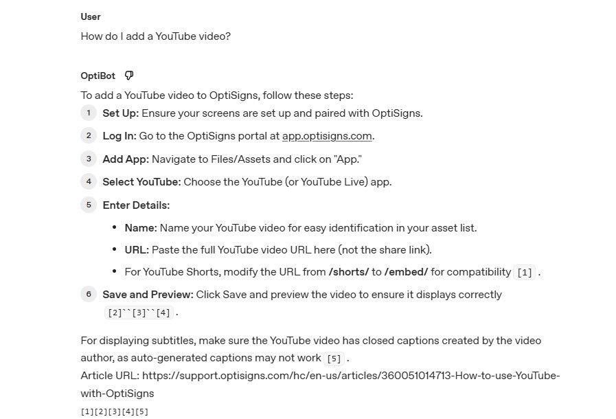

# OptiBot Knowledge Base Sync

Scrapes the OptiSigns Help Center, converts articles to Markdown, and uploads them to an OpenAI Vector Store powering an Assistants API chatbot.

---

## Setup

```bash
# 1. Copy env template and fill in real values
cp .env.sample .env

# 2. Install dependencies
pip install -r requirements.txt
```

**Required environment variables** (see `.env.sample`):

| Variable | Where to get it |
|---|---|
| `OPENAI_API_KEY` | [platform.openai.com/api-keys](https://platform.openai.com/api-keys) |
| `OPENAI_ASSISTANT_ID` | Assistants page → assistant detail URL (`asst_...`) |

---

## How to run locally

```bash
# Run the full pipeline once (scrape → upload → attach)
python main.py
```

Expected output:
```
==================================================
OptiBot daily sync — START
==================================================
Fetching articles from Zendesk...
Total articles found: 398
Scrape complete — added=398  updated=0  skipped=0
...
Upload complete — added=398  updated=0
Total files in vector store: 398
Attached vector store vs_xxx to assistant asst_xxx
==================================================
OptiBot daily sync — DONE
==================================================
```

---

## How to run with Docker

```bash
# Build the image
docker build -t optibot-sync .

# Run once and exit
docker run --env-file .env --rm optibot-sync
```

---

## Chunking strategy

Each `.md` file corresponds to one Zendesk article. The file begins with the article title and an `Article URL:` line so the model can cite the source.

OpenAI's `file_search` tool handles sub-chunking automatically using an 800-token window with 400-token overlap. This means:

- **One file = one logical document** — no manual splitting needed.
- Overlap ensures sentences that fall on chunk boundaries are still retrievable.
- Each run logs `added / updated / skipped` counts for both scraping and uploading.

---

## Daily job logs

[> _Link to DigitalOcean job logs._](https://cloud.digitalocean.com/apps/2b94dd15-8c03-4dab-86f2-1d986e641a0a/jobs/6e49b6d9-defa-43fa-af98-0eb3fdf44a58)

---

## Playground screenshot



---

## Project structure

```
├── scraper/
│   ├── scrape.py        # fetch articles from Zendesk API with change detection
│   └── html_to_md.py    # convert HTML → clean Markdown
├── uploader/
│   └── upload.py        # delta upload to OpenAI Vector Store
├── articles/            # generated Markdown files (git-ignored)
├── main.py              # pipeline entry point
├── Dockerfile
├── .env.sample
└── requirements.txt
```
